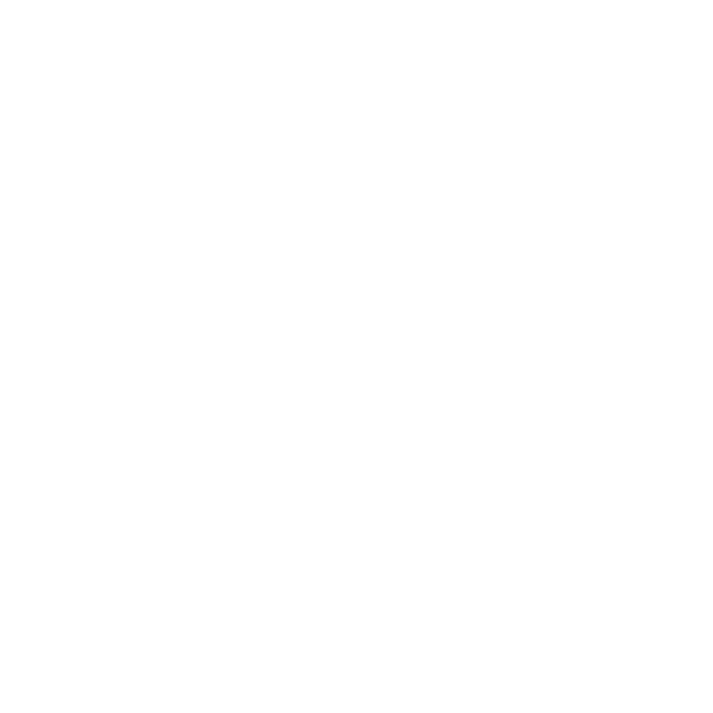
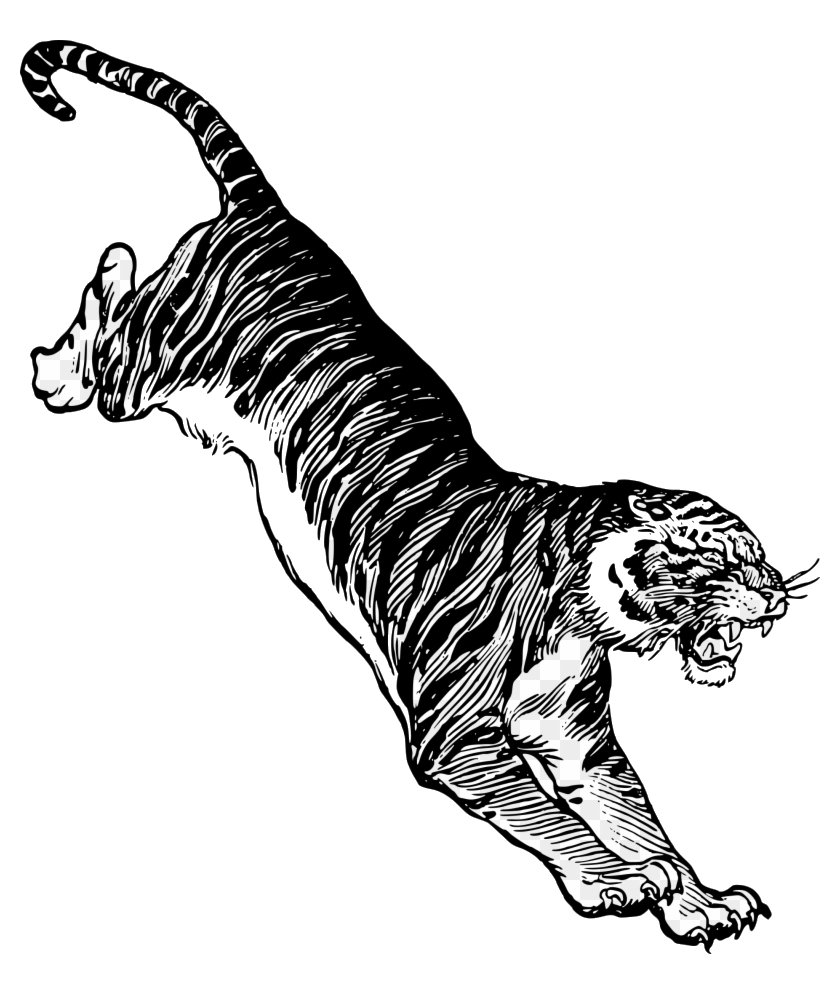
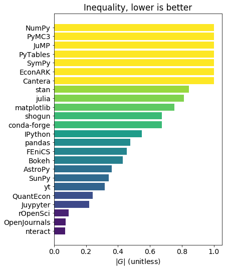

class: center, middle, inverse

# Inequality of Underrepresented Groups in Core Project Leadership

~OR~

.bigger[Escape from Monoculture Island]

Anthony Scopatz

[@scopatz](https://twitter.com/scopatz), [Quansight](https://www.quansight.com/)

SciPy 2019

---
class: center

# Author's Note

 
 
 
 
 

.bigger[This talk isn't about me]

 
 
 

--

.bigger[We will mix discussion & narrative in a "choose-our-own-adventure"
    improv style]

---
class: center, middle, inverse, fancy

# Chapter 1

???

Icons made by <a href="https://www.flaticon.com/authors/surang" title="surang">surang</a> from <a href="https://www.flaticon.com/"                 title="Flaticon">www.flaticon.com</a> is licensed by <a href="http://creativecommons.org/licenses/by/3.0/"                 title="Creative Commons BY 3.0" target="_blank">CC 3.0 BY</a>

---
# Disaster!

.center.bigger[.red[🚨**Warning**🚨]   The following depicts true events, only
the names have been changed.  <u>Viewer discrestion is advised.</u>]

--

.bigger[Your cruise ship has crashed into a reef.]

--

.bigger[Luckily, you swim to the shore of the nearby deserted island.]

--

.bigger[All you have is two weeks worth of rations and
high-quality podcasting equipment.]

---
# Disaster!

.bigger[Rescue is impossible.]

.bigger[The reef is just too powerful!]

--

.bigger[A mysterious benefactor will air drop you supplies
if you produce a biweekly podcast about
[the future of Open Source Software](https://www.quansight.com/open-source-directions).]

--

 

.large.center[**Naturally, you agree.**]

---
name: ch1-podcasting
# Podcasting

.bigger[After a few months, you have gained a small following.]

--

.bigger[Your friend and colleague Fernando Perez discretely emails you
to point out that *all* of the podcast guests have been
white men.]

--

.large-fancy[**Do You?**]

.bigger[
1. [Stop podcasting, in shame](#ch1-stop)
2. [Keep podcasting the way you have been](#ch1-keep)
3. [Check your privilege](#ch1-check)
]

---
name: ch1-stop
# Stop podcasting, in shame

.bigger[Your benefactor stops sending supplies.]

--

 

.center.large-fancy[You Starve]

.center[[respawn](#ch1-podcasting)]

---
name: ch1-keep
# Keep podcasting the way you have been

.bigger[You don't change and neither does the world.]

--

 

.center.large-fancy[Rescue Never Comes]

.center[[respawn](#ch1-podcasting)]

---
name: ch1-check
# Check your privilege

 
 
 
 
 
 
 

.center.bigger[You decide to re-evaluate your entire approach to podcasting about
open source issues.]

---
class: center, middle, inverse, fancy

# Chapter 2

???

Icon made from <a href="http://www.onlinewebfonts.com/icon">Icon Fonts</a> is licensed by CC BY 3.0

.bigger[What questions can you ask your guests about
their diversity & inclusion efforts?]

.bigger[How can you help move the conversation?]

(Time Limit: 1 min)

.big[[Return to Hut](#ch2-scoping)]

---
name: ch2-forest
# Walk in the jungle

.bigger[Approaching the jungle, you scare four vultures out of a tree.]

--

.bigger[Their callings remind you that you can call on your friends for help.]

--

.bigger[After all, that's what friends are for!]

--

.bigger[Perhaps one of your friends would be interested in co-hosting with you.]

---
class: center, middle

# Discussion

.bigger[How can a co-host help bring a missing perspective to the podcast?]

.bigger[What qualities of a co-host do you would want?]

(Time Limit: 1 min)

---
# Walk in the jungle

.bigger[You forgot about the tiger hunting you this whole time!]

--

.center.bigger[Yes, this island has a tiger, obviously.]

.center.bigger[[Run Back to Your Hut!](#ch2-scoping)]

---
name: ch2-volcano
# Hike the volcano

.bigger[Seeking help from online discussion forums at the peak of the local
volcano, you slip on a treacherous ledge and fall into the lava below.]

--

.center.large-fancy[You Died]

.center[[respawn](#ch2-scoping)]

---
name: ch2-cave
# Cave entrance

.bigger[You approach the entrance to a cave. Around you is a jungle.
A small stream flows into the cave.]

.bigger[There is a shiny brass lamp nearby.]

 

--

.large-fancy[**Do You?**]

.bigger[
1. [Get lamp](#ch2-get-lamp)
2. [Enter cave](#ch2-enter-cave-no-lamp)
]

---
name: ch2-get-lamp
# Cave

.bigger[OK. You have a lamp.]

 

--

.large-fancy[**Do You?**]

.bigger[
1. [Turn on lamp](#ch2-turn-on-lamp-outside-cave)
2. [Enter cave](#ch2-enter-cave-with-lamp-off)
]

---
name: ch2-enter-cave-no-lamp
# Cave

.bigger[It is now pitch dark. If you proceed you will likely fall into a pit.]

 

--

.large-fancy[**Do You?**]

.bigger[
1. [Proceed](#ch2-fall-into-pit)
2. [Go Back](#ch2-fall-into-pit)
]

---
name: ch2-fall-into-pit
# Cave

.bigger[Your footing slips. You begin to fall.]

--

.center.large-fancy[You Died]

.center[[respawn](#ch2-scoping)]

---
name: ch2-turn-on-lamp-outside-cave
# Cave

.bigger[Your lamp is now on.]

--

.bigger[Not wanting to return to your hut, you enter the cave.]

--

.bigger[The dim light from your lamp reveals a large, rocky pit.]

--

.bigger[The pit is easily avoided.]

 

--

.center.large-fancy[[Proceed](#ch2-debris-room)]

---
name: ch2-enter-cave-with-lamp-off
# Cave

.bigger[It is now pitch dark. If you proceed you will likely fall into a pit.]

 

--

.large-fancy[**Do You?**]

.bigger[
1. [Turn on Lamp](#ch2-turn-on-lamp-in-cave)
2. [Proceed](#ch2-fall-into-pit)
3. [Go Back](#ch2-fall-into-pit)
]

---
name: ch2-turn-on-lamp-in-cave
# Cave

.bigger[Your lamp is now on.]

--

.bigger[The dim light from your lamp reveals a large, rocky pit.]

--

.bigger[That was close! You almost fell in.]

--

.bigger[The pit is easily avoided.]

 

--

.center.large-fancy[[Proceed](#ch2-debris-room)]

---
name: ch2-debris-room
# Cave

.bigger[You are in a debris room filled with stuff washed in from the surface.]

--

.bigger[Finally! A nice place to relax.]

---
class: center, middle, inverse, fancy
# Chapter 3

---
name: ch3-blog
# Blog

.bigger[The detritus of previous generations of lost souls <u>politely</u>
reminds you to blog.]

--

.bigger[You decide to blog about the Open Source diversity issues affecting your
podcast.]

--

.large-fancy[**Do You?**]

.bigger[
1. [Develop a theory](#ch3-theory)
2. [Collect data](#ch3-data-no-theory)
3. [Plot your results](#ch3-plot-no-data)
4. [Write the blog!](#ch3-write-nothing)
]

---
name: ch3-data-no-theory
# Data collection

.big[You lack a general theory, so don't know where to look.]

--

.big[Before you can reexamine your mental framework, your lamp goes out due to
a lack of oxygen in the cavern.]

--

.center.large-fancy[You Suffocate]

.center[[respawn](#ch3-blog)]

---
name: ch3-plot-no-data
# Plotting

.big[You have no data to plot.]

--

.big[While you stare at a blank matplotlib figure, the
earth itself begins to violently shake!]

--

.center.large-fancy[You Are Crushed]

.center[[respawn](#ch3-blog)]

---
name: ch3-write-nothing
# Writing

.big[You open up Jupyter, but you have nothing to say and the
words fail to flow.]

--

.big[Suddenly, the debris-filled room fills with water!]

--

.center.large-fancy[You Drown]

.center[[respawn](#ch3-blog)]

---
name: ch3-theory
# Theory

.bigger[You realize that for an illuminating blog post you will
need a general theory of diversity.]

--

.bigger[You want a tool that is capable of handling many different
categories of equality.]

--

.bigger[You also want a tool that can handle many partitions, i.e.
beyond simple binary women/men models.]

---
class: center, middle
# Discussion

.bigger[What are axes of equality that you would like to see
discussed & analyzed?]

.bigger[For example, gender.]

(Time Limit: 1 min)

---
# Theory

.big[You [decide](https://github.com/scopatz/nf-project-inequality/blob/master/nf-project-inequality.ipynb)
that the Generalized Entropy Inequality measure (GEI, `G`) is just
the mathematical tool you are looking for!]

--

.big[`H` is your old friend, the Shannon Entropy.]

--

.big[It would sure be great if this were normalized to the level of equality in
population at large, `G(P)`. So you set the normed `|G|` for open source to,]

---
name: ch3-blog-with-theory
# Blog

.bigger[The detritus of previous generations of lost souls <u>sternly</u>
reminds you to blog.]

--

.bigger[You have a minimum of data for the Open Source diversity issues
affecting your podcast.]

--

.large-fancy[**Do You?**]

.bigger[
1. [Collect data](#ch3-data)
2. [Plot your results](#ch3-plot-no-data-with-theory)
3. [Write the blog!](#ch3-write-nothing-with-theory)
]

---

name: ch3-plot-no-data-with-theory
# Plotting

.big[You have no data to plot.]

--

.big[While you stare at a blank matplotlib figure, the
earth itself begins to violently shake!]

--

.center.large-fancy[You Are Crushed]

.center[[respawn](#ch3-blog-with-theory)]

---
name: ch3-write-nothing-with-theory
# Writing

.big[You open up Jupyter, but you have nothing to say and the
words fail to flow.]

--

.big[Suddenly, the debris-filled room fills with water!]

--

.center.large-fancy[You Drown]

.center[[respawn](#ch3-blog-with-theory)]

---
name: ch3-data
# Collect data

.bigger[Your podcast itself inspires you. You decide to look at diversity within
[NumFOCUS](https://numfocus.org/) project leadership.]

--

.bigger[You also decide to look at gender partitioned with
`female`, `male`, & `nonbinary` (`S=3`).]

--

.bigger[So how to count the project leadership...]

 

--

.center.large[There are no grad students on this island!]

---
name: ch3-collect-data-leadership
# Collect data

.bigger[To determine leadership, you use the following algorithm:]

 

---
template: ch3-collect-data-leadership

.big[
1. Scrape project websites. Use listed steering committee ([Jupyter](https://jupyter.org/about))
   or core team ([conda-forge](https://conda-forge.org/docs/orga/governance.html#current-members-of-core)) as leadership body.
]

---
template: ch3-collect-data-leadership

.big[
1. Scrape project websites. Use listed steering committee ([Jupyter](https://jupyter.org/about))
   or core team ([conda-forge](https://conda-forge.org/docs/orga/governance.html#current-members-of-core)) as leadership body.
2. If no leadership body is posted, count top contributors as those with more than
   150 commits (in spite of the "tyranny of code contribution").
]

---
template: ch3-collect-data-leadership

.big[
1. Scrape project websites. Use listed steering committee ([Jupyter](https://jupyter.org/about))
   or core team ([conda-forge](https://conda-forge.org/docs/orga/governance.html#current-members-of-core)) as leadership body.
2. If no leadership body is posted, count top contributors as those with more than
   150 commits (in spite of the "tyranny of code contribution").
3. Be as inclusive as possible; include all past members and subcommittee members
   ([pandas](https://github.com/pandas-dev/pandas-governance)).
]

 

--

.center.large[Store results in `data.json`]

---
name: ch3-blog-with-data
# Blog

.bigger[The detritus of previous generations of lost souls <u>relentlessly</u>
reminds you to blog.]

--

.bigger[You have a minimal data set for the Open Source diversity issues
affecting your podcast.]

--

.large-fancy[**Do You?**]

.bigger[
1. [Plot your results](#ch3-plot)
2. [Write the blog!](#ch3-write-nothing-with-data)
]

---
name: ch3-write-nothing-with-data
# Writing

.big[You open up Jupyter, but you have no pretty pictures to present and the
words fail to flow.]

--

.big[Suddenly, the debris-filled room fills with water!]

--

.center.large-fancy[You Drown]

.center[[respawn](#ch3-blog-with-data)]

---
name: ch3-plot
# Plot the data

.bigger[In the waning light of your lamp, you fire up Jupyter, matplotlib,
and a trusty JSON parser.]

 

--

.bigger[You call `plt.barh()`.]

 

--

.bigger[You call `plt.get_cmap('viridis')`.]

 

--

.bigger[The screen flickers...]

---
name: ch3-actual-plot
# Plot the data

---
class: center, middle
# Discussion

.bigger[What does this data say about our community?]

.bigger[What are the strategies that projects like `nteract` are employing?]

.bigger[Are these applicable to other projects?]

(Time Limit: 2 min)

---
template: ch3-actual-plot

---
# Write the blog!

.bigger[At last, you open an new Jupyter notebook.]

--

.bigger[It is called `Untitled1.ipynb`.]

--

.bigger[The words flow freely, your prose is top-notch,
and your analysis is unassailable.]

--

.bigger[You tweet out a [binder](https://gke.mybinder.org/) link to the world.]

--

.bigger[You cunning dog, you.]

--

.bigger[Yet, you can't bring yourself to rename the file.]

--

.center.large-fancy[[Proceed](#ch4-phil)]

---
class: center, middle, inverse, fancy
name: ch4-phil
# Chapter 4

---
name: ch4-leave-cave
# Climb out

.bigger[You start your trek back to your hut.]

--

.bigger[After leaving the debris room and avoid the pit, you exit the cave.]

--

.bigger[As you leave, you hear a loud rumbling, which sounds like gears.]

--

.large-fancy[**Do You?**]

.bigger[
1. [Hike the volcano to post to Stack Overflow](#ch4-volcano)
2. [Search the overgrown ruins of dead ideas](#ch4-ruins)
3. [Run back to your hut](#ch4-run)
]

---
name: ch4-volcano
# Hike the volcano

.bigger[Seeking help from online discussion forums at the peak of the local
volcano, you slip on a treacherous ledge and fall into the lava below.]

--

.center.large-fancy[You Died]

.center[[respawn](#ch4-leave-cave)]

---
name: ch4-ruins
# Search the ruins

.bigger[You decide to search the overgrown ruins
in search of the loud grinding sound.]

--

.bigger[Suddenly, the cobblestones
give way under your feet, dropping you into a pool of acid.]

--

.center.large-fancy[You Died]

.center[[respawn](#ch4-leave-cave)]

---
name: ch4-run
# Run back!

.bigger[You have decided on the safest option. Flee!]

--

.bigger[Your vigorous workout makes you think that there are
are both active diversity issues and passive ones.]

--

.bigger[<u>**Active</u>:** A toxic community / culture
that prevents & destroys equitable systems.]

--

.bigger[<u>**Passive</u>:** Significant biases prevent agents
from making major strides toward equality.]

--

.bigger[*Wow!* You brain works so well while physically active.
*You should try to run more.*]

---
class: center, middle
# Discussion

.bigger[What mechanisms do we have to help address
active & passive issues?]

(Time Limit: 2 min)

---
# Hut

.bigger[You arrive back at your hut, safe & sound.]

 

--

.bigger[The sound of grinding gears has stopped. Odd.]

 

--

.bigger[It is time to try to get off this island.]

 

--

.center.large-fancy[[Proceed](#ch5-hut)]

---
class: center, middle, inverse, fancy
name: ch5-hut
# Chapter 5

---
name: ch5-plan
# Hut

.bigger[You are sick of podcasting for peanuts.]

--

.bigger[Also, your phone is blowing up with twitter notifications.]

--

.large-fancy[**Do You?**]

.bigger[
1. [Check Twitter](#ch5-twitter)
2. [Update Your Apps](#ch5-apps)
3. [Keep Podcasting](#ch5-podcast)
]

---
name: ch5-twitter
# Check Twitter

.bigger[Your notebook tweet has gone viral!
 And, of course, started a flame war...]

--

.bigger[You get sucked in, and fail to notice the volcano
erupting. You are swimming in lava.]

--

.left-column[
 
 
.center.large-fancy[You Died]
]

.bigger[.center[[respawn](#ch5-plan)]]

---
name: ch5-apps
# Update Your Apps

.bigger[You decide to update your apps. A new one catches your eye.]

--

.bigger[Lyft Lift is a new drone-based ride sharing service.
You use a promo code to order one.]

--

.bigger[As you ascend over open water back to civilization,
a battery catches fire and you plummet into the ocean.]

--

.bigger[Lyft Lift *is* still in beta.]

.bigger[.center[[swim back to shore](#ch5-plan)]]

---
name: ch5-podcast
# Keep Podcasting

.bigger[You have learned to accept your fate and decide to keep
podcasting.]

--

.bigger[The equality issues in Open Source software are not going
to disappear overnight.]

--

.bigger[But, through active, positive engagement you realize you can
help build a more welcoming community for everyone.]

--

.center.bigger[*Hey!* Those mindfulness audio-books you downloaded seem to be working!]

---
class: center, middle, inverse, fancy
name: the-end
# The End

---
class: center, middle, inverse
.large[

<table>
  <tr>
    <td>Anthony Scopatz</td>
    <td><a href="https://twitter.com/scopatz">@scopatz</a></td>
  </tr>
  <tr style="background: #00000000;">
    <td>
      

        
      

    </td>
    <td><a href="https://www.quansight.com/">Quansight.com</a></td>
  </tr>
  <tr>
    <td>
      

        
      

    </td>
    <td><a href="http://faiross.com/">FairOSS.com</a></td>
  </tr>
</table>

]
